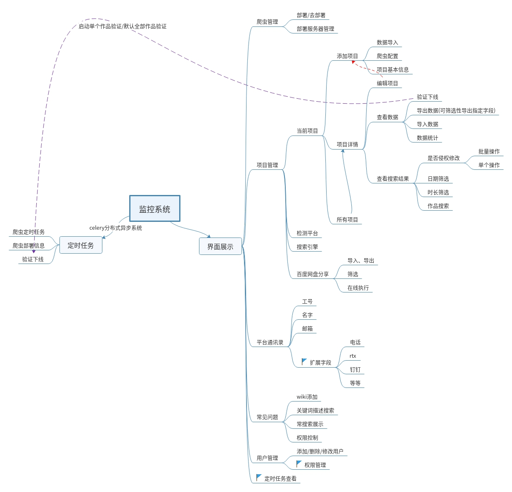

.. _main:

项目设计
---------

模块
______

1. 爬虫。数据获取和简单数据清洗
#. celery 异步任务执行、系统（网站级别的定时任务）
#. crontab 操作系统的定时任务
#. web 界面展示，用于对数据的可视化、可操作处理

爬虫
>>>>>>>>>

大部分爬虫采用时下较受欢迎的爬虫框架scrapy，级部署scrapyd.方便其扩展、部署。

还配备远程浏览器chromedriver,对部分反机器爬虫的起到了重要的支持。

celery
>>>>>>>>

芹菜是一个很优秀的异步的、可分布式的框架、解决了网站对耗时且急于执行的需求。本系统对百度网盘及搜索引擎的爬虫都有相应的需求。

crontab
>>>>>>>>>

这是linux 和unix的系统级别的定时任务，本站为什么不用celery定时任务去替代它呢？主要是因为celery的定时任务需要写死在配置文件、然后重启服务再生效，而我们的需求是随时更改定时任务，不可能每次修改定时任务去重启网站。

web界面
>>>>>>>>>>>

1. 权限管理
#. 爬虫管理
#. 数据展示
#. wiki

等等

这里我们设计用户登陆ip的配置、权限的配置目前只是通过修改配置文件的信息来完成，当然是以用户绑定角色的形式。
权限和细分到每一个连接。

爬虫的管理、主要是方便部署、很传参数、同时这里通过表单实现来爬虫的定向爬虫及定时爬虫等功能。

数据展示，这里有多样的搜索数据方式、可以导出导入数据。也有直观的数据统计。

wiki支持多样的编辑、图片视频的传入、使得反应的问题更直观，解决方案更易懂等待。

.. note:: 为什么不采用mysql而是采用了postgresql

    1. mysql对json数据的存储支持得还不算友好。而爬虫的数据结构再很多时候都是不可确定的，如：有些网站会将视频分类得很详细、然而有些网站则没有分类。而现在我们知道类别很重要，但又不知道确认是怎样的重要。
    2. 长连接8小时，系统会断开。这自然是可以解决的，不过我可能需要破环peewee模块得以实现，加上已上的需求，要更改的代码可以让我创建一个第三方库了。
   

.. note:: 为什么不设计界面来管理角色的创建

    首先，可以设计。
    角色要对于的是一棵权限树，这个表单其实是js的事情，在界面上展示一颗树目前有很多前端框架，都很好，但与datatables结合的完好的很少。datatables editor的扩展也是需要时间的。而我们的需求可能只用两三个角色，为此耗费很多时间来做这个界面其实是不值当的。

